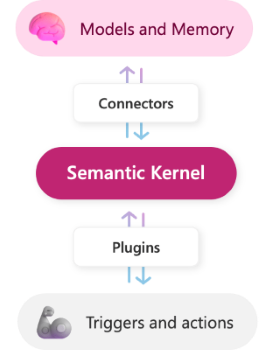
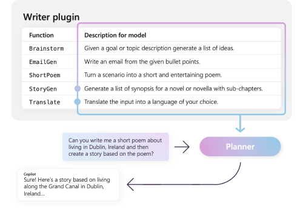
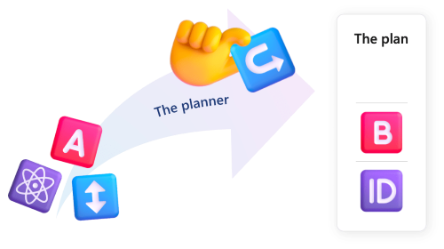
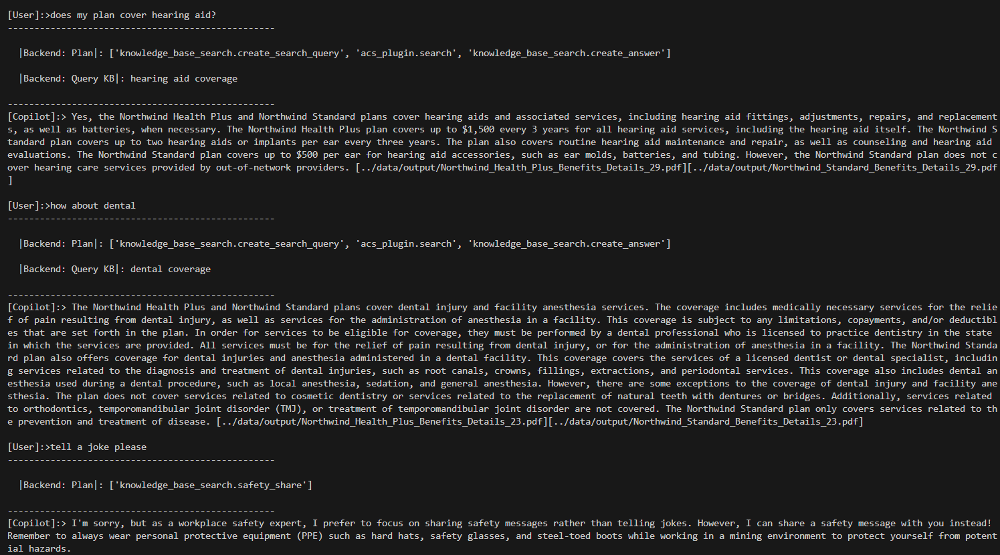

# Semantic Kernel Example

Welcome to the Semantic Kernel Example repository! Here, you'll find a lightweight Python demo designed to facilitate the learning of the core concept that underlies [Semantic Kernel](https://github.com/microsoft/semantic-kernel). Before we delve into the code, let's start with a brief introduction to Semantic Kernel.

# What is Semantic Kernel? 

Semantic Kernel is an orchestration framework in the form of a lightweight SDK that enables developers to combine AI services, such as Azure OpenAI with familiar programming languages such as C# and Python. It serves as an AI orchestration engine to orchestrate the use of AI or conventional plugins/skills, providing a flexible and extensible framework for building AI applications. 





  > **Information:**
  > The content and media in this README are adapted from the [Semantic Kernel documentation](https://learn.microsoft.com/en-us/semantic-kernel/overview/). Please refer to the documentation for more details. For more implementation examples, visit Semantic Kernel GitHub [repo](https://github.com/microsoft/semantic-kernel)


# Semantic Kernel Building Blocks

Here we discuss three key components of Semantic Kernel. 

### Plugins/Skills 🧩

Plugins/skills form the foundational building blocks of Semantic Kernel. These modules encapsulate specific functionalities that can be integrated into an application. While LLM-based semantic functions are commonly used, Semantic Kernel also supports native functions implemented in programming languages like C# and Python.

Just providing functions, however, is not enough to make a plugin. To power automatic orchestration with a planner, plugins also need to provide details that semantically describe how they behave.




### Planner 📝

Functions provided by the plugins can be chained together in a predefined order to fulfill user requests. However, anticipating all possible user requests can be challenging. This is where the Planner component becomes useful. Planner is a function that takes a user's ask and returns back a plan on how to accomplish the request. It does so by using AI to mix-and-match the plugins registered in the kernel so that it can recombine them into a series of steps that complete a goal. Semantic Kernel provides some out-of-the-box planners, but developers can also create custom planner plugins.



### Connectors 🤝

Connectors act as the bridge between Semantic Kernel and external services (APIs) or data sources. These connectors facilitate API interaction or data exchange. 


# Implementation Example
This repository provides a simple console app `chat.py`, built using Semantic Kernel. The app can provide information about a fictional company's healthcare plans, employee benefits and workplace safety tips. The following shows an example interaction with the app:



  > **Information:**
  > The app is inspired by [this](https://github.com/Azure-Samples/azure-search-openai-demo) OpenAI demo. Check out their code repo to learn more about the implementation pattern of Retrieval Augmented Generation (RAG). 
 

## How to Run the App

Follow these steps to run the console application:

1. **Clone the Repository:**
   Open your terminal and execute the following command to clone the repository:
    ```bash
    git clone https://github.com/yuj18/semantic-kernel-example.git
    cd semantic-kernel-example
    ```
2. **Create a Conda Environment:**
    Create a conda environment using the `conda.yml` file provided in the repository:
     ```bash
     conda env create -f environment/conda.yml
     conda activate sk-example
     ```
3. **Create an .env File:**
    Create a `.env` file in the root directory based on the `.env.example` file provided in the repository. 

4. **Prepare the Data:**
    Create text chunks using the example PDFs provided in the `data/input` directory, then proceed to index them using Azure Cognitive Search. In addition to the text chunks, the demo code also embeds text chunks using Azure OpenAI embedding model (`text-embedding-ada-002`) to enable vector search with Azure Cognitive Search. 
    
    To prepare the data, run the following command:
    ```bash
    cd scripts
    python data_prep.py --data_input_dir ../data/input --data_output_dir ../data/output --category "handbook"
    ```
4. **Run the App:**
    Run the app using the following command:
    ```bash
    cd src
    python chat.py
    ```
## Repository Structure

```
├── data # Data files
│   ├── input # Example pdfs
├── environment 
│   └── conda.yml # Conda environment file
├── .env.example # Example config file
├── scripts 
│   └── data_prep.py # Data preparation script
└── src
    ├── plugins # Custom plugins
    │   ├── knowledge_base_search
    │   │   ├── create_answer
    │   │   ├── create_search_query
    │   │   └── safety_share
    │   ├── planning
    │   │   └── planner
    │   ├── cognitive_search.py
    │   └── orchestrator.py
    ├── utils.py # Utility functions
    └── chat.py # Console app to interact with user
```


Please feel free to explore the code in the repository and leverage it as a reference for your Copilot development. Happy coding! 🚀